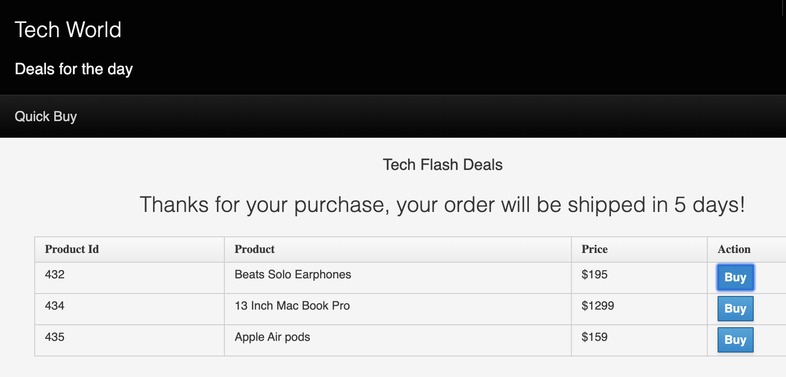
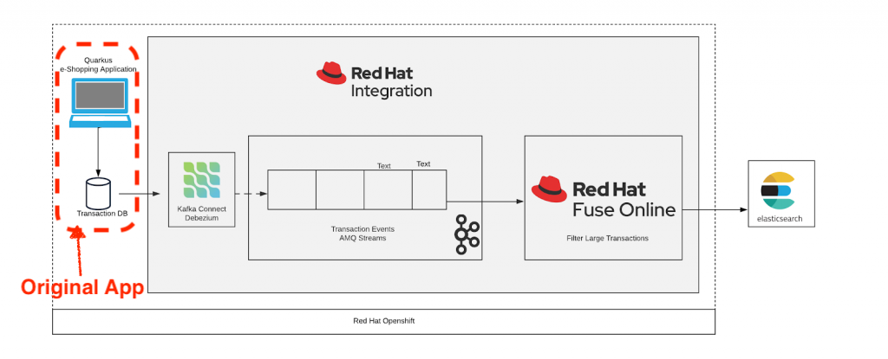

= Change Data Capture with Debezium (on OpenShift 4.3) =

This demo shows how you can install Debezium on an OpenShift 4.3 (and above) cluster.

There is a small app at the heart of the demo that is writing to a MySQL database (it's added to this repo as a submodule).  

We start with that app and slowly add the following:

1. Use operators to install AMQ Streams on the cluster (pre-requisite for Debezium)
2. Setup KafkaConnectS2I
3. Build and install the Debezium Connector for MySQL
4. Demonstrate change events coming through Debezium 
5. Use fuse to transform events coming out of the Database for feeding into Elastisearch
6. Publish connector metrics to central OpenShift Monitoring
7. Install a custom grafana dashboard to visualize metrics

[NOTE]
.This repo has sub-modules
====
To clone this repo as required, you will need to issue this command

----
git clone --recurse-submodules https://github.com/hatmarch/cdc-and-debezium-demo.git
----

Where _https://github.com/hatmarch/cdc-and-debezium-demo.git_ is assumed to be the repo name

====

[NOTE]
====
Commands assume that you have run this command from the root of the git repo.

----
source scripts/shell-setup.sh
----
====

== Initial Project and App Setup ==

First log into an OpenShift 4.3 cluster using an account with cluster-admin privileges.

First thing that needs to be done is to deploy the original application including a MySQL database that is ready to be connected to Debezium.

----
$DEMO_HOME/scripts/00-setup-app.sh
----

As part of this process, the current user will be granted `anyuid` scc privileges as this is required for the debezium provided databasefootnote:database[MySQL databases need to be configured to write their transactions to the rowlevel `binlog` (among other things).  The MySQL database that is used in this demo is from a debezium image and is already setup in this way.  If you use a different MySQL image you will need to ensure the MySQL database is configured correctly as outlined link:https://debezium.io/documentation/reference/1.0/connectors/mysql.html#setting-up-mysql[here]]

The script will also create the database and check that the schema has been created correctly.

If all went well, the last lines of output should look like this:footnote:[If output does not match then you can look into link:/scripts/00-setup-app.sh[the shell script] for where things went wrong and run the commands manually]

----
MYSQL Pod is: mysql-1-r5kb4
mysql: [Warning] Using a password on the command line interface can be insecure.
mysql: [Warning] Using a password on the command line interface can be insecure.
count(*)
0
--> Found Docker image 88d914b (7 months old) from quay.io for "quay.io/quarkus/ubi-quarkus-native-s2i:19.0.2"

    Quarkus.io S2I (GraalVM Native) 
    ------------------------------- 
    Quarkus.io S2I image for building Kubernetes Native Java GraalVM applications and running its Native Executables

    Tags: builder, java, quarkus, native

    * An image stream tag will be created as "ubi-quarkus-native-s2i:19.0.2" that will track the source image
    * A source build using binary input will be created
      * The resulting image will be pushed to image stream tag "quarkus-transaction-crud:latest"
      * A binary build was created, use 'oc start-build --from-dir' to trigger a new build
    * This image will be deployed in deployment config "quarkus-transaction-crud"
    * Port 8080/tcp will be load balanced by service "quarkus-transaction-crud"
      * Other containers can access this service through the hostname "quarkus-transaction-crud"

--> Creating resources ...
    imagestream.image.openshift.io "ubi-quarkus-native-s2i" created
    imagestream.image.openshift.io "quarkus-transaction-crud" created
    buildconfig.build.openshift.io "quarkus-transaction-crud" created
    deploymentconfig.apps.openshift.io "quarkus-transaction-crud" created
    service "quarkus-transaction-crud" created
--> Success
    Use 'oc start-build quarkus-transaction-crud' to start a build.
    Application is not exposed. You can expose services to the outside world by executing one or more of the commands below:
     'oc expose svc/quarkus-transaction-crud' 
    Run 'oc status' to view your app.
buildconfig.build.openshift.io/quarkus-transaction-crud patched
Uploading directory "/workspaces/cdc-and-debezium-demo/demo-crud-app" as binary input for the build ...
...........................
route.route.openshift.io/quarkus-transaction-crud exposed
Transaction generating application can be found at http://quarkus-transaction-crud-debezium-cdc.apps.cluster-mel-dbz-2189.mel-dbz-2189.example.opentlc.com/
----

Click on the link provided and you should see the app from the introduction

== Installing AMQ Streams ==

== KafkaConnect S2I

