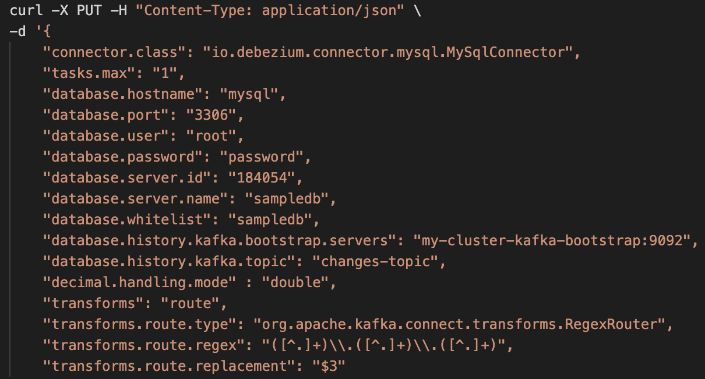
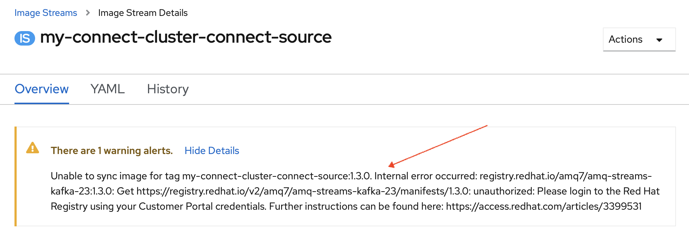
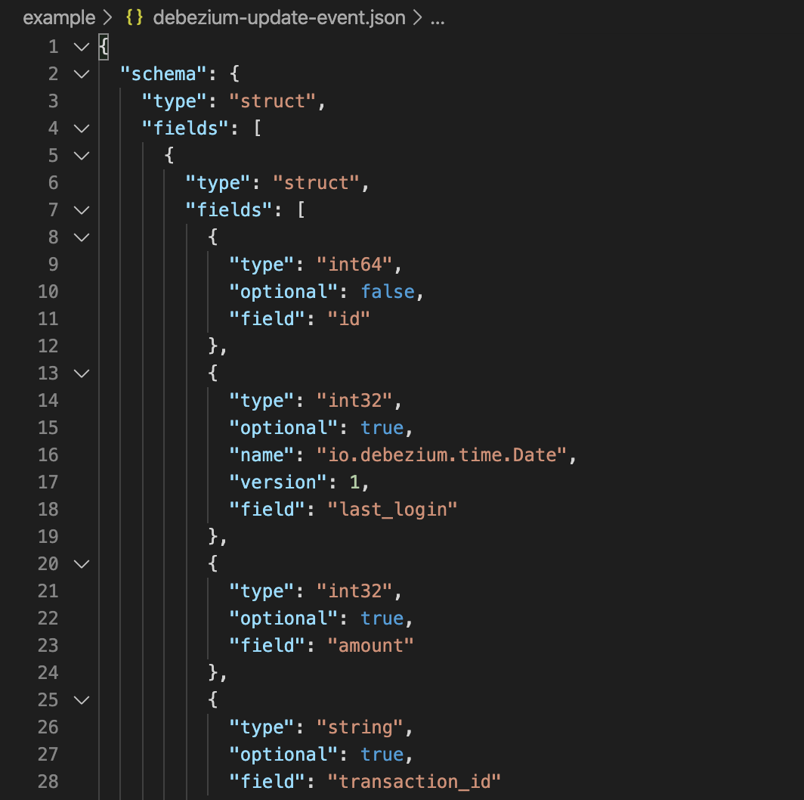
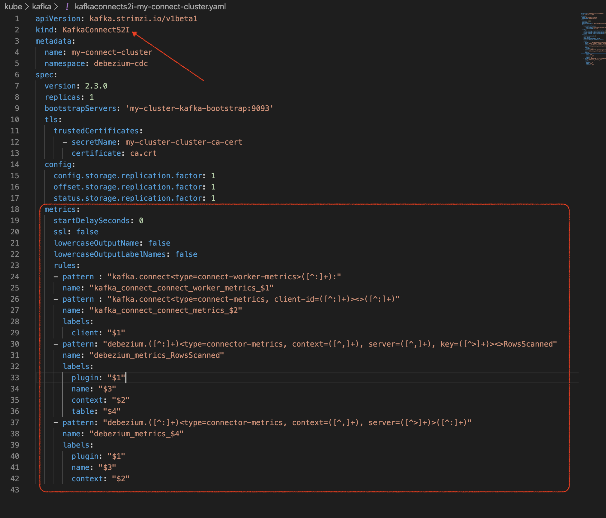
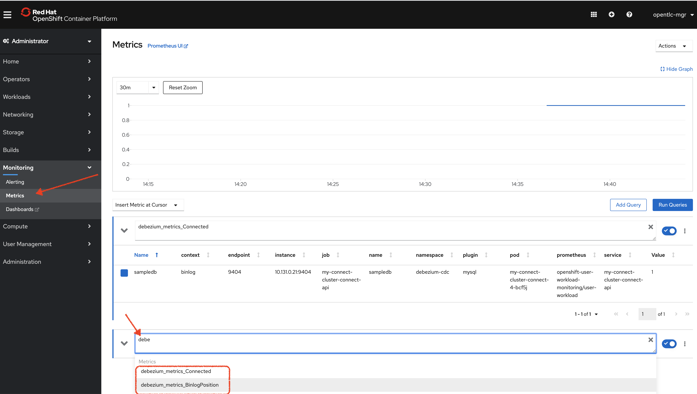
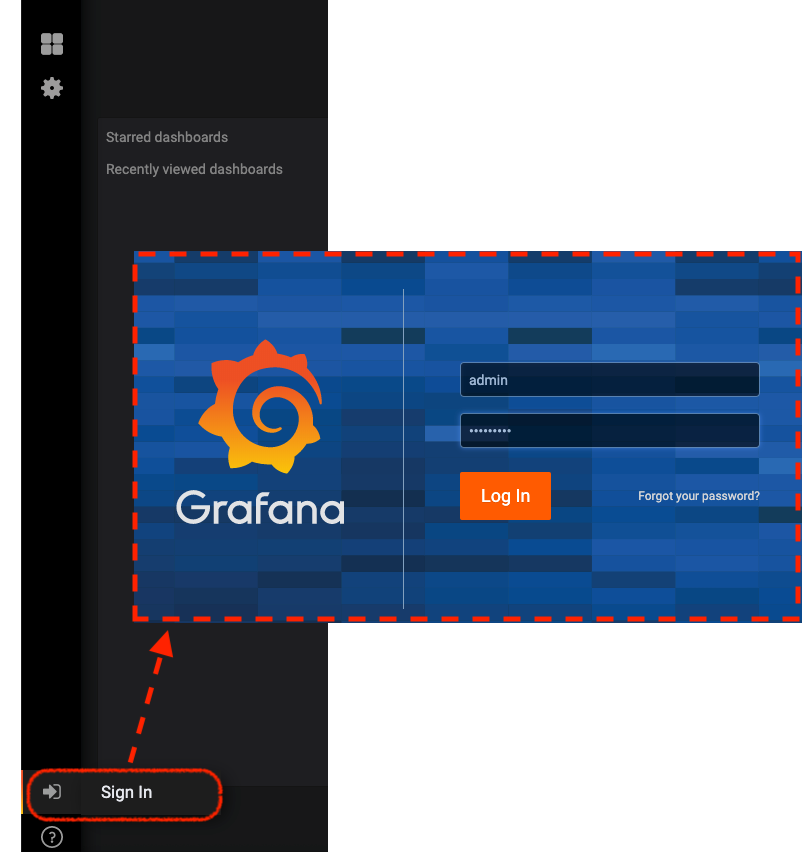
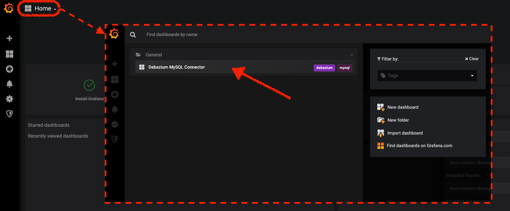
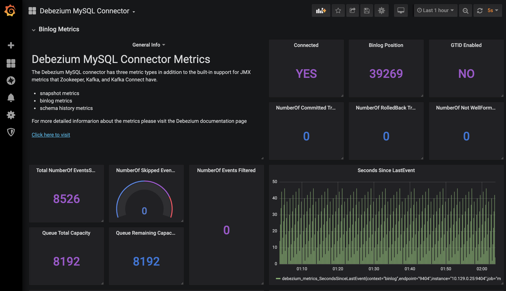

= Change Data Capture with Debezium (on OpenShift 4.3) =

This demo shows how you can install Debezium on an OpenShift 4.3 (and above) cluster.

There is a small app at the heart of the demo that is writing to a MySQL database (it's added to this repo as a submodule).  

image:images/original-app.png[]

We start with that app and slowly add the following:

1. <<Initial Project and App Setup,Deploying our Quarkus and MySQL based test app>>
1. <<Installing AMQ Streams,Use operators to install AMQ Streams on the cluster (with KafkaConnectS2I)>> (pre-requisite for Debezium)
3. <<Building Devezium Connector,Build and install the Debezium Connector for MySQL>>
4. <<Testing Connector,Demonstrate change events coming through Debezium>>
5. <<Fuse Online Installation,Use Fuse to transform events coming out of the Database for feeding into Elastisearch>>
6. <<Installing Custom Monitoring,Publish connector metrics to central OpenShift Monitoring>>
7. <<Custom Grafana Dashboard for Debezium,Install a custom grafana dashboard to visualize metrics>>

image:images/overall-arch.png[]

[NOTE]
.This repo has sub-modules
====
To clone this repo as required, you will need to issue this command

----
git clone --recurse-submodules https://github.com/hatmarch/cdc-and-debezium-demo.git
----

Where _https://github.com/hatmarch/cdc-and-debezium-demo.git_ is assumed to be the repo name

====

[NOTE]
====
Commands assume that you have run this command from the root of the git repo.

----
source scripts/shell-setup.sh
----
====

== Initial Project and App Setup ==

First log into an OpenShift 4.3 cluster using an account with cluster-admin privileges.

First thing that needs to be done is to deploy the original application including a MySQL database that is ready to be connected to Debezium.

----
$DEMO_HOME/scripts/00-setup-app.sh
----

As part of this process, the current user will be granted `anyuid` scc privileges as this is required for the debezium provided databasefootnote:database[MySQL databases need to be configured to write their transactions to the rowlevel `binlog` (among other things).  The MySQL database that is used in this demo is from a debezium image and is already setup in this way.  If you use a different MySQL image you will need to ensure the MySQL database is configured correctly as outlined link:https://debezium.io/documentation/reference/1.0/connectors/mysql.html#setting-up-mysql[here]]

The script will also create the database and check that the schema has been created correctly.

If all went well, the last lines of output should look like this:footnote:[If output does not match then you can look into link:scripts/00-setup-app.sh[the shell script] for where things went wrong and run the commands manually]

----
MYSQL Pod is: mysql-1-r5kb4
mysql: [Warning] Using a password on the command line interface can be insecure.
mysql: [Warning] Using a password on the command line interface can be insecure.
count(*)
0
--> Found Docker image 88d914b (7 months old) from quay.io for "quay.io/quarkus/ubi-quarkus-native-s2i:19.0.2"

    Quarkus.io S2I (GraalVM Native) 
    ------------------------------- 
    Quarkus.io S2I image for building Kubernetes Native Java GraalVM applications and running its Native Executables

    Tags: builder, java, quarkus, native

    * An image stream tag will be created as "ubi-quarkus-native-s2i:19.0.2" that will track the source image
    * A source build using binary input will be created
      * The resulting image will be pushed to image stream tag "quarkus-transaction-crud:latest"
      * A binary build was created, use 'oc start-build --from-dir' to trigger a new build
    * This image will be deployed in deployment config "quarkus-transaction-crud"
    * Port 8080/tcp will be load balanced by service "quarkus-transaction-crud"
      * Other containers can access this service through the hostname "quarkus-transaction-crud"

--> Creating resources ...
    imagestream.image.openshift.io "ubi-quarkus-native-s2i" created
    imagestream.image.openshift.io "quarkus-transaction-crud" created
    buildconfig.build.openshift.io "quarkus-transaction-crud" created
    deploymentconfig.apps.openshift.io "quarkus-transaction-crud" created
    service "quarkus-transaction-crud" created
--> Success
    Use 'oc start-build quarkus-transaction-crud' to start a build.
    Application is not exposed. You can expose services to the outside world by executing one or more of the commands below:
     'oc expose svc/quarkus-transaction-crud' 
    Run 'oc status' to view your app.
buildconfig.build.openshift.io/quarkus-transaction-crud patched
Uploading directory "/workspaces/cdc-and-debezium-demo/demo-crud-app" as binary input for the build ...
...........................
route.route.openshift.io/quarkus-transaction-crud exposed
Transaction generating application can be found at http://quarkus-transaction-crud-debezium-cdc.apps.cluster-mel-dbz-2189.mel-dbz-2189.example.opentlc.com/
----

Click on the link provided and you should see the app from the introduction

image:images/original-app.png[]

== Installing AMQ Streams ==

AMQ Streams is easily setup using an Red Hat's AMQ Operator.  This can be installed manually or can be done using the provided script.  Debezium will leverage Kafka's KafkaConnect functionality to allow changes sourced from the target database to be turned into consumeable events.

----
$DEMO_HOME/scripts/01-setup-kafka.sh
----

The script will do the following:

* Install amqstreams.v1.3.0 operator
* Create a kafka cluster in the debezium-cdc project
* install a secret for accessing quay.io (this is where the kafkaconnects2i image lives)
* Create the KafkaConnectS2I instance (for building the debezium connector)

== Building Debezium Connector ==

Now that the KafkaConnectS2I builder is installed, we can start a binary build with all our connector information.

This repo already has a local version of all the plugins the debezium connector needs at `$DEMO_HOME\kube\kafka\connect-plugins` but if you want to see where they were downloaded from (or want to update the contents of this directory) you can do the following:

----
rm -rf $DEMO_HOME/kube/kafka/connect-plugins
$DEMO_HOME/scripts/download-plugins.sh
----

Once we have our debezium plugins downloaded (which includes the MySQL plugin that we'll use to connect to the demo app's database we set up previously) we can create the connector

----
$DEMO_HOME/scripts/02-setup-debezium-connector.sh
----

This script will do the following:

* build the debezium kafka connector from what's in the connect-plugins directory
* Create a route to the connect api
* Check that the debezium kafka connector can be reached
* Register and configure a new connector at the end point called `debezium-connector-mysql`

If the command has run successfully, you should see this at the end of the run:
----
Checking that the mysql connector has been initialized:
["debezium-connector-mysql"]
done.
----

This indicates that the connector has been successfully built, deployed, and a configuration called `debezium-connector-mysql` has been registered.  If you are not seeing this output, then check the <<Common Issues>> section below.

Here are some of the aspects that were configured as part of `debezium-connector-mysql`:

If the connector is setup correctly it will create a number of different topics based on the database and the events it's been configured to look for.  For more information see the link:www.debezium.io[official web site]

[TIP]
====
You can a list of all currently registered topics (including those registered by the connector) by running this command
----
oc exec -c kafka my-cluster-kafka-0 -- /opt/kafka/bin/kafka-topics.sh --bootstrap-server my-cluster-kafka-bootstrap:9092 -n debezium-monitoring --list
----
====

=== Common Issues ===

==== Image Registry issues ====

If you see this error:

----
The ImageStreamTag "my-connect-cluster-connect-source:1.3.0" is invalid: from: Error resolving ImageStreamTag my-connect-cluster-connect-source:1.3.0 in namespace debezium-cdc: unable to find latest tagged image
----

It's probably an issue with your registry.io credentials.  Open the ImageStreams tab of the project and look at the `my-connect-cluster-connect-source` image stream.  If you see a warning at the top that when expanded looks like this:

Then you likely have an issue with the secret that was provided to log into registry.io.  Check your login details and update the secret `connects2i` and re-run the script.

[NOTE]
====
The official documentation generally recommends linking the `default` and/or `builder` service accounts with the (pull-) secret.  This wasn't necessary in my testing.  If you want to try this, the calls are:

----
oc secrets link default connects2i -n debezium-cdc
oc secrets link builder connects2i -n debezium-cdc
----
====

In some cases if you can't get the imagestream to do the pull correctly, you might need to [red]#completely uninstall the kafka operator# (not just the connnect component) to get things to reset

----
oc delete csv/amqstreams.v1.3.0
----

== Testing Connector ==

Test the connector by seeing messages come in as we change records in the demo-app's database

1. Start watching the queue that represents database cdc events
----
oc exec -c kafka my-cluster-kafka-0 -- /opt/kafka/bin/kafka-console-consumer.sh --bootstrap-server localhost:9092 --topic sampledb -n debezium-monitoring --from-beginning --max-messages 1
----
1. open the demo-app
2. Click buy

You should see the following from the consumer window:

or prettified:

== Fuse Online Installation ==

Next we'll install Fuse online as the bridge between our CDC events from Debezium to our Elasticsearch instance.  

[NOTE]
.If you didn't bring your own Elasticsearch instance
====
This demo can be setup to connect to any Elasticsearch instance to which you have access.  If you don't have one handy, you can attempt to setup your own instance by installing cluster-logging on the OpenShift cluster.  

You can setup cluster-logging by following the directions link:docs/CustomLogging.adoc[here].
====

Install Fuse Online into our cluster by running this script:

----
$DEMO_HOME/06-fuse-setup.sh
----

This script does the following:

* Installs the FuseOnline operator
* Installs an instance of FuseOnline in the debezium-cdc project and waits until it finishes
* Finds the route to the FuseOnline dashboard

When the installation is complete, you should see the route to the FuseOnline (Syndesis) dashboard printed out.  Follow this link and log in with your OpenShift credentials.  You should then see the following screen:

image:images/fuse-online-dashboard.png

== Installing Custom Monitoring ==

The debezium connector we deployed has also the JMX plugin installed within it that allows it to expose metrics to openshift.  We'll take advantage of OpenShift's custom ServiceMonitor (new in OpenShift 4.3) to dump those metrics into the central OpenShift prometheus instance

The metrics were actually enabled in the previous step.  They were defined in the KafkaConnectS2I instance under the `metrics` key

To setup custom monitoring run:

----
$DEMO_HOME/scripts/03-setup-custom-monitoring.sh
----

Which does the following:

1. Activates and enables UserWorkloads by updating `cluster-monitoring-config`
2. waits for user-workload pods to come up successfully in openshift-monitoring
3. creates a ServiceMonitor to scrape metrics out of the debezium connector

You can tell the custom monitoring has been successful by navigating to the central metrics dashboard and typing in a metric that starts with `debezium` (see also the metrics section of link:kube/kafka/kafkaconnects2i-my-connect-cluster.yaml[kafkaconnects2i-my-connect-cluster.yaml])

== Custom Grafana Dashboard for Debezium ==

Now that (debezium-based) metrics are coming in from our debezium connector and flowing into the `openshift-monitoring` prometheus instance, we can now setup a custom dashboard to visualize our connector.  _The dashboard we'll be installing is based on the work by Bhunvanesh in his post link:https://medium.com/searce/grafana-dashboard-for-monitoring-debezium-mysql-connector-d5c28acf905b[here]._

There are a few things we need to keep in mind before setting up this connector:

* There is no ability to create a custom dashboard in the built-in `openshift-monitoring` grafana because admin access is not possible [blue]#thus we need to create our own#

* The existing grafana operator (v2.0.0) does not support a version of grafana that has the necessary features for use to configure querying the central `openshift-monitoring` prometheus [blue]#thus we will install the operator apart from the OLM and the operator's link:https://github.com/integr8ly/grafana-operator[repo] is setup as a submodule of this one#

* There appears to be a bug in the translation of the `GrafanaDashboard` CustomResource into a ConfigMap for the Grafana instance [blue]#thus we install the `GrafanaDashboard` and ConfigMap at the same time using a template#

The installation of the custom Grafana dashboard should be fully automated by running this script with the following two parameters:

1. *Project Name*: The name of the project to deploy the dashboard in.  Default is `debezium-monitoring`

2. *Grafana Admin Password*: The admin password for use in accessing Grafana in admin capacity.  Default is `openshift`

[NOTE]
====
The dashboard will connect to the `thanos-querier` using the oauth-proxy on port 9091.  It will skip TLS verify and will connect using the `grafana-serviceaccount` which is granted `cluster-monitoring-view` role.

For more details, look link:scripts/04-setup-custom-grafana.sh[into the bash script]
====

----
$DEMO_HOME/scripts/04-setup-custom-grafana.sh debezium-monitoring openshift 
----

When the script has finished, you should see the following which ends with the route to the new Grafana instance

----
Warning: oc apply should be used on resource created by either oc create --save-config or oc apply
configmap/grafana-datasources configured
grafanadashboard.integreatly.org/dbz-dashboard created
deployment.extensions/grafana-deployment condition met
https://grafana-route-debezium-monitoring.apps.cluster-mel-dbz-2189.mel-dbz-2189.example.opentlc.com/
----

Click on that link (note that sometimes that pod hasn't completely finished initializing) and log into the dashboard using the _admin password_ you specified earlier

Once logged in, you should be able to find the debezium dashboard by clicking on _Home_ and then selecting the debezium dashboard:

Opening the dashboard you should see something like this:

To get the metrics to look more real-time, you might consider adjusting the timings in the upper right corner of the dashboard

image:images/dashboard-update.png[]