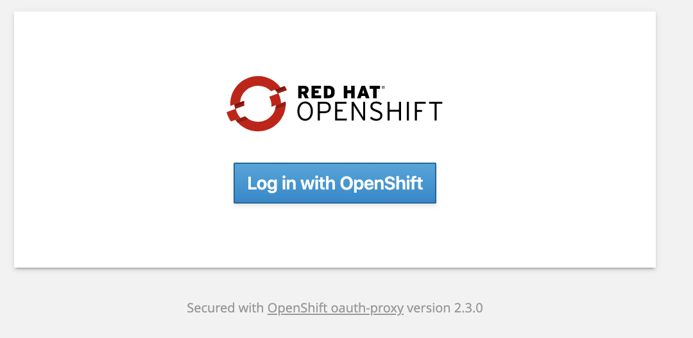
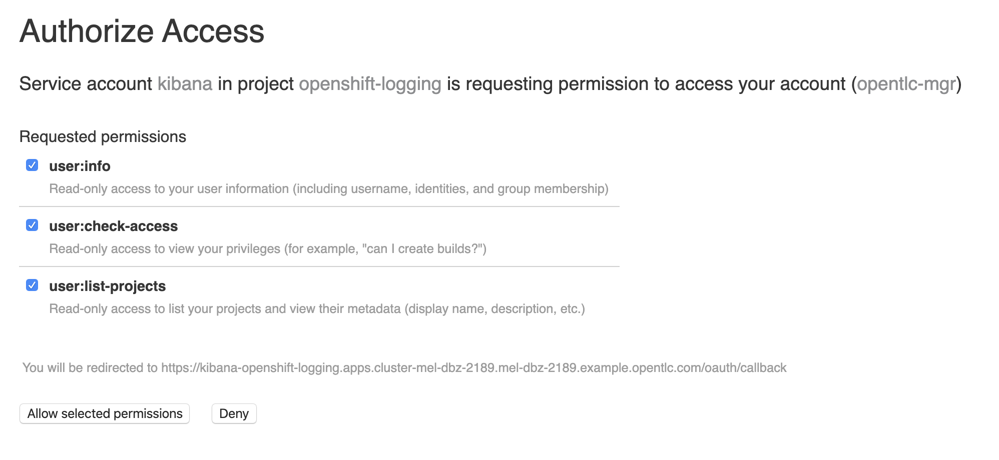
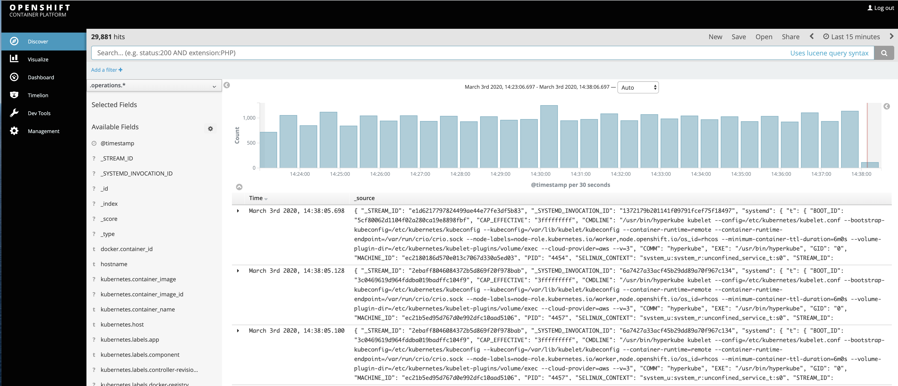
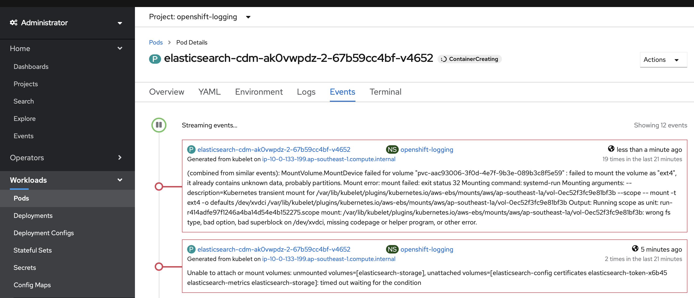

= OPTIONAL: Setting up custom logging =

This documents setup of cluster logging within an OpenShift cluster and is intended for suitably sized clusters running OpenShift version 4.3 or later.  This is a possible target for the Fuse integration in the main part of the demo, however it is not necessary as fuse can connect to other elastic search instances.

Most the the instructions here follow the link:https://docs.openshift.com/container-platform/4.3/logging/cluster-logging-deploying.html[official documentation] on deploying custom logging.

[NOTE]
====
[red]#You will need cluster admin access to be able to run this script successfully.#
====

== Install Elastic Search Operator (in prescribed fashion) ==

We going to run a script that will install the elasticsearch operator on all projects on the cluster and then create a cluster logging instance in a project called "openshift-logging".  This will gather all log information from all projects and will create a kibana instance that will give us a UI into the log data.

[TIP] If your cluster is small or only useful for a demo you can configure the link:../kube/logging/customlogging-instance.yaml[`Cluster Logging` CR] to require fewer resources including <<Run Elasicsearch in Ephemeral Mode,running Elasticsearch in Ephemeral Mode>> to reduce need for persistent volumes.

Run the following command to install:

----
$DEMO_HOME/scripts/05-optional-setup-custom-logging.sh
----

If the script has completed successfully you should see this at the end:

----
Kibana route is:
https://kibana-openshift-logging.apps.debezium.openshifttc.com/
----

NOTE: If the script seems to be stuck, quits with an error, or seems to have been running for a long time, check the <<Troubleshooting,troubleshooting>> section of this document.

Click on the route that is spit out at the end of the installation script.  From there enter your OpenShift login details.  

After successful login, you will be asked to allow kibana certain permissions.  Click _Allow selected permissions_.

If you accept these prompts, you should then be brought to the kibana dashboard for the elastic search instance for the cluster

Happy log splunking!

== Appendix ==

=== Run Elasicsearch in Ephemeral Mode ===

You can configure Cluster Logging's Elasticsearch to not require persistent volumes (with the tradeoff that logs won't persist).  This can be preferrable in a demo environment where resources are tight.  (See also instructions link:https://docs.openshift.com/container-platform/4.3/logging/config/cluster-logging-elasticsearch.html#cluster-logging-elasticsearch-persistent-storage-empty_cluster-logging-elasticsearch[here])

To do this, update the link:../kube/logging/customlogging-instance.yaml[`Cluster Logging` CR] to specify the `emptyDir` as follows:

Then either run the installation or update the cluster logging instancefootnote:instance[This has not yet been verified to auto-update on a pre-existing installation.  You may need to first delete the `ClusterLogging` CR and then re-apply]:

----
oc apply -f $DEMO_HOME/kube/logging/customlogging-instance.yaml -n openshift-logging
----

=== Troubleshooting ===

If the script doesn't finish after about 5 minutes and you're continuing to see lines like this:

----
deployment.extensions/cluster-logging-operator condition met
2 of 5 ready...
2 of 5 ready...
2 of 5 ready...
2 of 5 ready...
2 of 5 ready...
2 of 5 ready...
2 of 5 ready...
2 of 5 ready...
2 of 5 ready...
2 of 5 ready...
2 of 5 ready...
2 of 5 ready...
2 of 5 ready...
2 of 5 ready...
2 of 5 ready...
----

Then there may be a persistent issue blocking the installation.  Here's an example of a random issue with a failure to mount a persistent volume

If the error looks to be a transient one, you can attempt to reinstall cluster logging by deleting the cluster logging CR instance, waiting a little bit for all the resources to be cleaned up (leaving only the operator pod in the `openshift-logging` namespace) and re-run the script

----
oc delete clusterlogging instance -n openshift-logging
----

Wait for the output of `oc get pods` to look something like this:
----
NAME                                            READY   STATUS    RESTARTS   AGE
cluster-logging-operator-66f77ffccb-fdptp       1/1     Running   0          38m
----