= End to End Demo =

In this section we integrate all the different pieces to show information flowing from the demostration website all the way through to Elasticsearch and Kibana.

NOTE: Instructions assume all the different components have been installed as per link:../README.adoc[here].  It's also assumed that the link:scripts/shell-setup.sh

== Component Setup ==

=== Test App ===

Open the test app in a window using the route printed by this

----
echo "http://$(oc get route quarkus-transaction-crud -o jsonpath='{ .spec.host }')/"
----

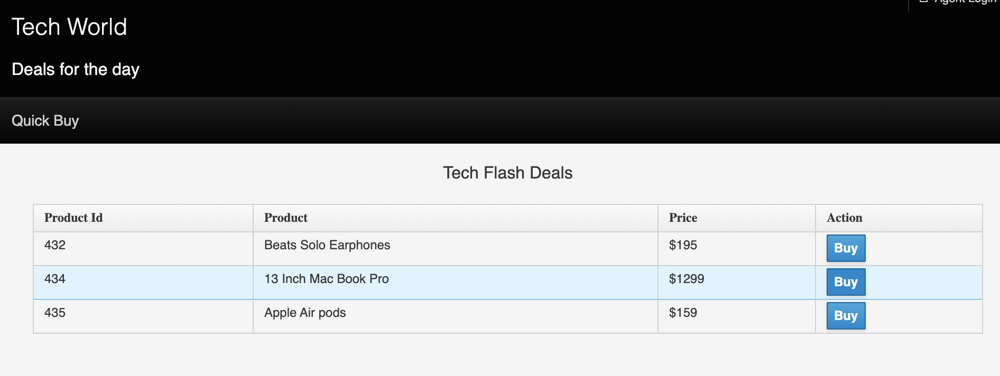

=== Kafka ===

To be able to see events that come in from the Debezium Connector setup a shell with a kafka consumer.  Open a shell and run the following command:

----
oc exec -c kafka my-cluster-kafka-0 -n debezium-cdc -- /opt/kafka/bin/kafka-console-consumer.sh --bootstrap-server localhost:9092 --topic sampledb.sampledb.transaction
----

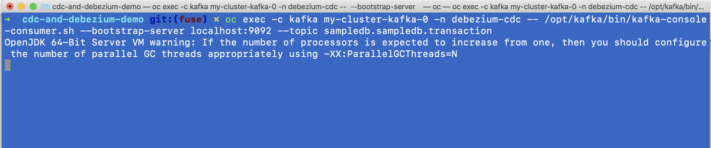

=== Fuse Online ===

Display the activity window of the integration.

1. Open the Fuse Online window

----
echo "https://$(oc get route syndesis -n debezium-cdc -o jsonpath='{ .spec.host }')"
----

2. Start the integration if it hasn't been already

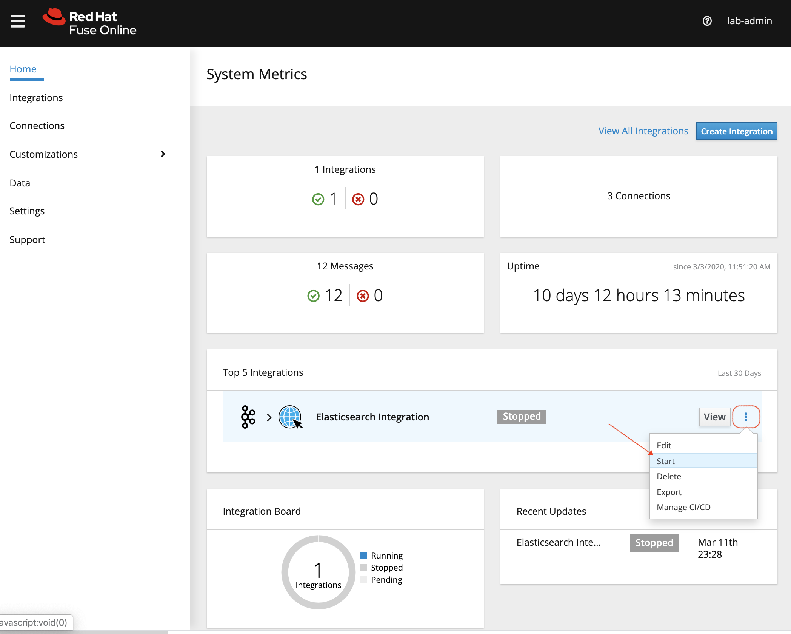

3. _After a few minutes the integration should start up._  Then click view and then select the _Activity_ tab

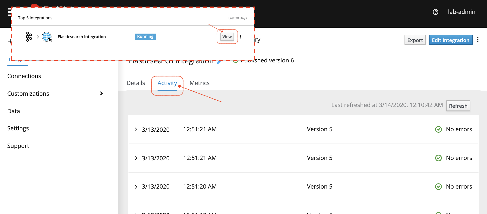

4. The refresh button can be used to see events processed by the integration

=== Grafana Dashboard ===

Show the stats visualized out of the Debezium Connector

1. Open the Grafana Dashboard

----
echo "https://$(oc get route grafana-route -n debezium-monitoring -o jsonpath='{.spec.host}')"
----

2. Select the _Debezium MySQL Connector_ dashboard

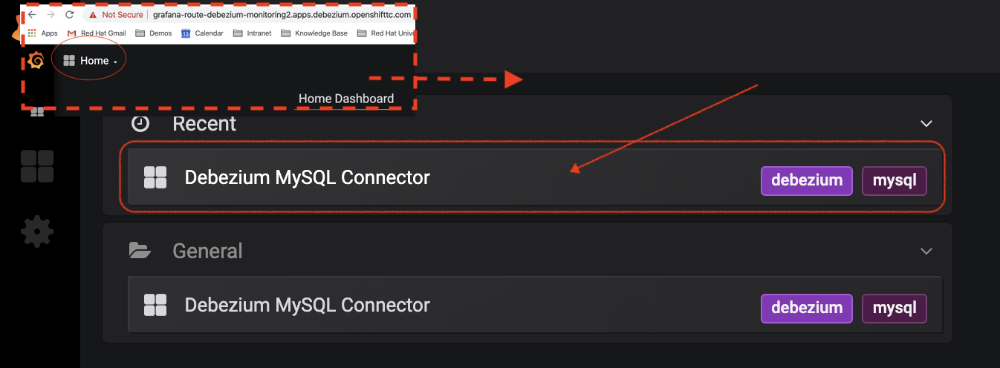

3. Update the polling on the dashboard to be as frequent as possible

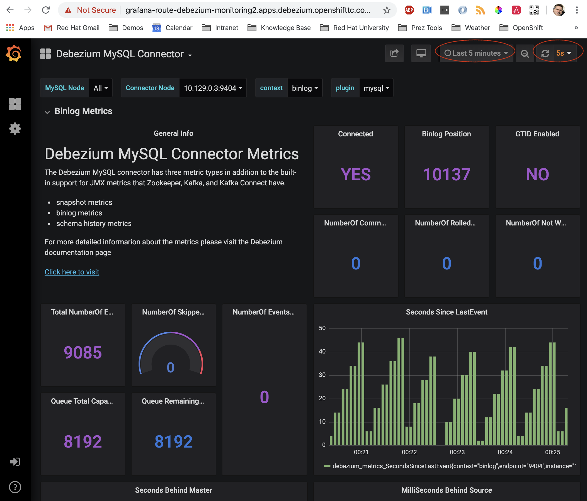

[NOTE]
.Viewing active connector
====
Be sure that the dashboard is setting an active node's data as sometimes it can fix on a connector's data that is not currently active

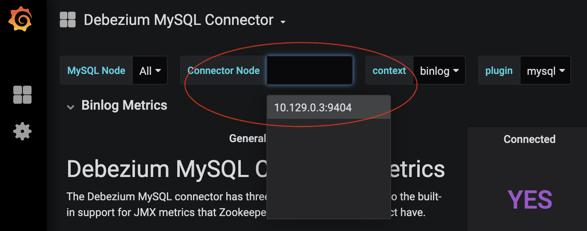
====

=== Kibana and Elasticsearch ===

For this, we want to be able to show the log entries in Elasticsearch that make it through our Fuse Online integration.  One of the best ways to visualize this is to use the Kibana instance that was created as part of the link:CustomLogging.adoc[Cluster Logging Installation]

1. Open the kibana dashboard by opening the route below:

----
echo "https://$(oc get route kibana -n openshift-logging -o jsonpath="'{ .spec.host }')/
----

2. Select _Management_ and then select _Index patterns_

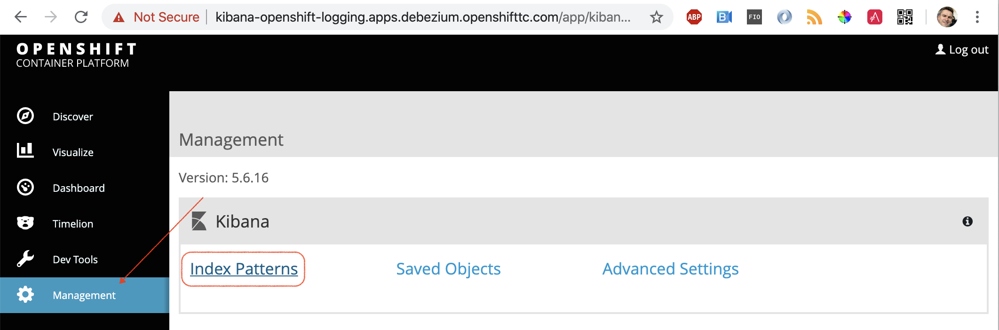

3. Press _Create Index_ and then on the screen that appears, clear the _Index Pattern_ text box and type in `transaction*` for find the indexes that are created by our Fuse Online Integration.  Then press _Create_

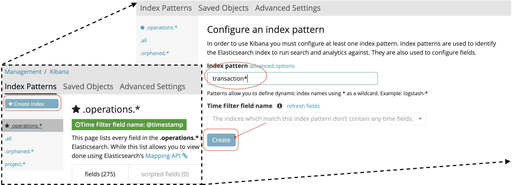

4. Upon clicking create, you should see a screen with the fields of the index.  Verify these are the correct fields

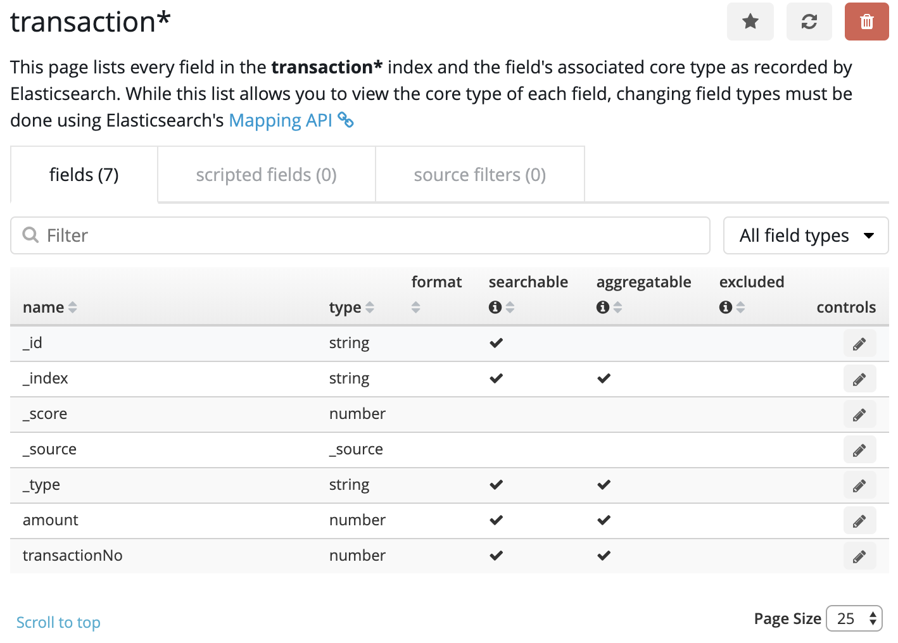

=== Window Layout ===

Here's a possible layout of windows

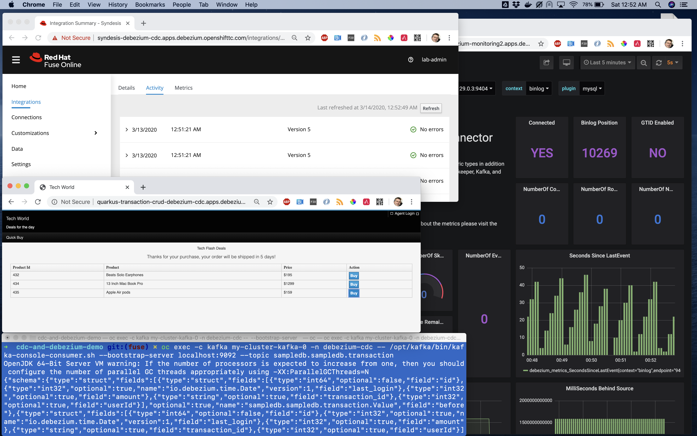

== Demo Steps ==

=== Purchase Item Less than $1000 ===

[red]#FIXME#

1. Go to the demo app, purchase an item less than $1000

2. Notice change in Grafana Dashboard

2. Notice the change data event in kafka consumer

3. Refresh the Fuse Online activity

4. Look at the details of the Fuse Online activity

5. Open the entry corresponding to this purchase and show that Elasticsearch did not get called as purchased item is less than $1000

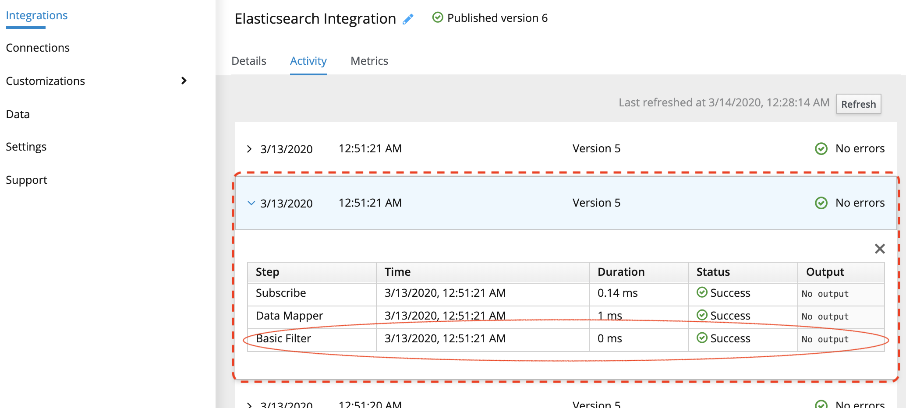

=== Purchase Item Greater than $1000 ===

[red]#FIXME#

1. Go to the demo app, purchase an item greater than $1000

2. Notice change in Grafana Dashboard

3. Refresh the Fuse Online activity

4. Look at the details of the Fuse Online activity

5. Open the entry corresponding to this purchase and show that Elasticsearch *did* get called as purchased item is more than $1000

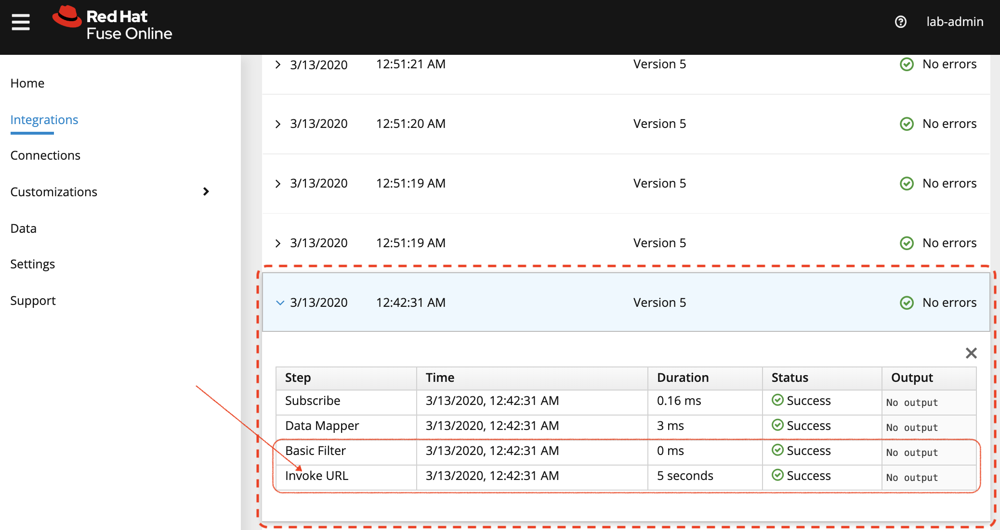

6. Show new entry under transaction log in Kibana

7. Show that the amount and transactionNo matches that in the kafka window